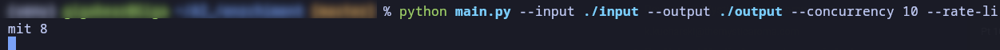
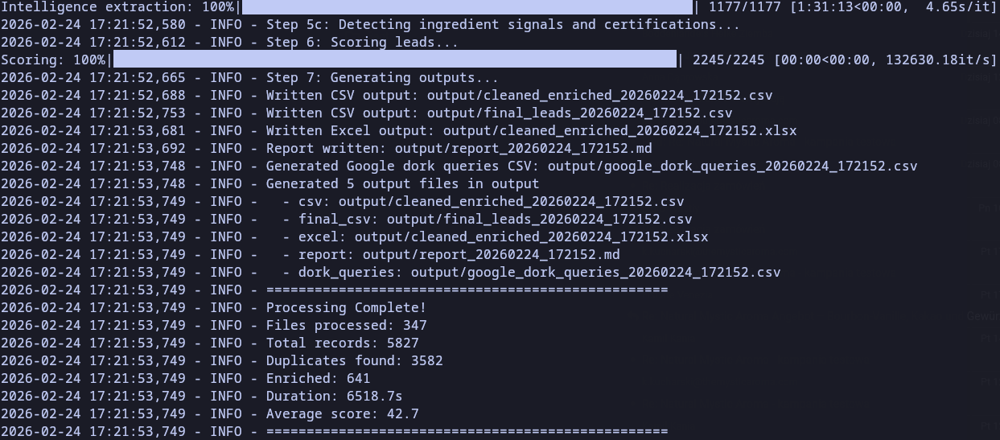
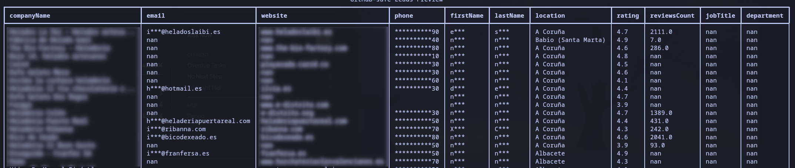
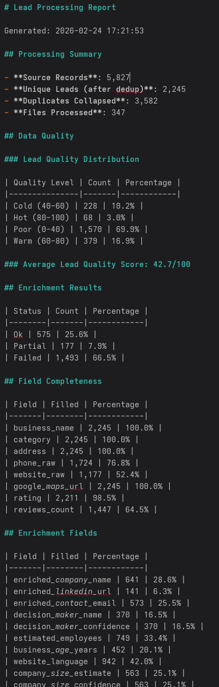

# Lead Enrichment Pipeline

A production-grade Python pipeline for cleaning, deduplicating, and enriching B2B lead data from Google Maps exports. Built for cold email outreach to food, HoReCa, and cosmetology businesses across Europe.

---

## What It Does

Raw Google Maps CSV exports contain duplicate entries, inconsistent formatting, missing contact information, and no way to prioritize leads. This pipeline solves all of that in a single command.

**Input:** One or more raw CSV exports from Google Maps  
**Output:** A cleaned, deduplicated, enriched dataset with contact emails, decision maker names, company size estimates, and a quality score per lead

### Pipeline stages

```
Read CSVs  →  Clean  →  Deduplicate  →  Enrich  →  Score  →  Output
```

| Stage | What happens |
|---|---|
| **Read** | Auto-detects encoding and column layout across multiple CSV files |
| **Clean** | Normalizes phone numbers (libphonenumber), URLs, addresses, ratings |
| **Deduplicate** | Finds duplicates by phone, domain, and fuzzy name match (rapidfuzz); marks the best representative |
| **Enrich** | Crawls business websites; extracts emails, social links, owner names, Schema.org data, EU legal/Impressum pages |
| **Score** | Assigns each lead a quality score (0-100) and a prospect relevance score based on category, ingredient signals, and certifications |
| **Output** | Full CSV, Excel file, slim outreach-ready CSV, Google dork queries for LinkedIn research, Markdown report |

---

## Key Capabilities

### Contact extraction
- Scrapes emails directly from business websites
- Parses EU legal pages (Impressum, mentions legales, aviso legal) in DE/FR/IT/ES/NL/PL/PT formats to extract owner names, VAT IDs, and company registration numbers
- Extracts structured data from Schema.org / JSON-LD markup (founder, contactPoint, openingHours, geo coordinates)
- Generates likely contact email patterns (info@, contact@, hello@) as fallback
- Optional SMTP email verification with catch-all detection

### Company intelligence
- Estimates employee count from 7 independent signals: structured data, team page content, careers page, review volume, API providers, and category-based priors — with weighted confidence scoring
- Detects business age from copyright years, founding mentions, and domain registration
- Identifies website language (EN/DE/FR/IT/ES/PT/NL/PL)
- Detects ingredient keywords (vanilla, cacao, spices) and quality certifications (organic, fair trade, halal, kosher, vegan, BDIH, Ecocert)

### Deduplication
- Three-tier matching: exact phone, exact domain, fuzzy business name (85% threshold)
- Promotes the most data-rich record from each duplicate group
- Tracks how many times a business appeared across source files (`duplicate_count`) — a proxy for prominence

### Scoring
Two independent scores per lead:

**Lead quality score (0-100)** — measures how actionable this record is for outreach:
- Decision maker name + email: +25
- Scraped contact email: +20
- Valid website: +10
- Complete business info: +10
- Valid phone: +5, high rating: +5, reviews: +5, social presence: +5, company size known: +5, generic emails: +5

**Target prospect score (0-100)** — measures relevance to vanilla/cacao/spice sales:
- Business category (primary/secondary/distributor/beauty): up to +40
- Ingredient keyword signals from website content: up to +20
- Certification signals: up to +10
- Lead quality factor: up to +30

### Enrichment providers
- **free** (default): website crawling only, no API keys required
- **Clearbit**, **Apollo.io**, **Hunter.io**: drop-in via `--provider` flag with fallback chaining

---

## Output Files

| File | Contents |
|---|---|
| `cleaned_enriched_[timestamp].csv` | Full enriched dataset, all columns |
| `cleaned_enriched_[timestamp].xlsx` | Same data in Excel format |
| `final_leads_[timestamp].csv` | Slim outreach-ready CSV (key columns only) |
| `google_dork_queries_[timestamp].csv` | LinkedIn/XING search queries for manual prospecting |
| `report_[timestamp].md` | Run statistics and quality summary |

### Key output columns

| Column | Description |
|---|---|
| `decision_maker_name` | Owner or manager name extracted from legal pages or website |
| `decision_maker_confidence` | high / medium / low |
| `enriched_contact_email` | Best email found on the website |
| `enriched_generic_emails` | Generated pattern emails (info@, contact@, etc.) |
| `enriched_linkedin_url` | Company LinkedIn page |
| `enriched_facebook_url`, `enriched_instagram_url` | Social profiles |
| `estimated_employees` | 1, 2-5, 5-20, 20-50, 50+ |
| `company_size_confidence` | high / medium / low |
| `business_age_years` | Years in operation |
| `website_language` | EN, DE, FR, IT, ES, PT, NL, PL |
| `duplicate_count` | How many source file entries this record consolidated |
| `lead_quality_score` | 0-100 overall outreach quality |
| `target_prospect_score` | 0-100 relevance to vanilla/cacao/spice business |
| `lead_category` | hot (>=75), warm (>=50), cold (>=30), poor |
| `ingredient_signals` | Ingredient keywords found on the website |
| `certifications` | Certification keywords found |

---

## CLI Reference

```
python main.py [OPTIONS]
```

| Flag | Default | Description |
|---|---|---|
| `--input`, `-i` | `./leads` | Directory containing input CSV files |
| `--output`, `-o` | `./output` | Directory for output files |
| `--provider`, `-p` | `free` | Primary enrichment provider: `free`, `clearbit`, `apollo`, `hunter` |
| `--provider2` | — | Fallback provider if primary returns no data |
| `--rate-limit` | `3` | API requests per second |
| `--concurrency`, `-c` | `5` | Concurrent enrichment workers |
| `--cache` | `./cache/cache.sqlite` | SQLite cache path |
| `--skip-cached` | — | Skip domains already present in cache |
| `--skip-enrichment` | — | Clean and dedupe only, no enrichment |
| `--verify-emails` | — | Verify emails via MX lookup and SMTP check |
| `--filter-categories` | — | Comma-separated category keywords to include |
| `--min-score` | — | Minimum lead quality score required before using a paid provider |
| `--crawl-language` | `auto` | Prioritize crawl routes for a specific country language |
| `--no-dedupe` | — | Skip deduplication |
| `--quick` | — | Lighter enrichment, slim CSV only — faster turnaround |
| `--resume` | — | Resume from last checkpoint |
| `--checkpoint-interval` | `50` | Save checkpoint every N records |
| `--clear-cache` | — | Clear the cache before processing |
| `--dry-run` | — | Process but do not write output files |
| `--slim-only` | — | Generate slim CSV from an existing full output without re-running |
| `--from-file` | — | Path to an existing `cleaned_enriched_*.csv` for `--slim-only` |
| `--verbose`, `-v` | — | Enable debug logging |

---

## Architecture

```
app/
├── pipeline.py          # Orchestrates all steps
├── clean.py             # Phone, URL, address, rating normalization
├── dedupe.py            # Duplicate detection (phone / domain / fuzzy)
├── scoring.py           # Lead quality and prospect relevance scoring
├── crawl_fallback.py    # Website crawler (emails, social links, Schema.org)
├── cache.py             # SQLite result cache + domain denylist
├── checkpoint.py        # Resumable processing state
├── io.py                # CSV/Excel I/O with encoding auto-detection
├── report.py            # Output generation and statistics
├── utils.py             # Email validation, domain extraction, URL normalization
└── enrich/
    ├── providers.py           # Clearbit, Apollo, Hunter integration
    ├── decision_maker.py      # Owner/manager extraction
    ├── company_intel.py       # Company size, age, language detection
    ├── company_size_estimator.py  # 7-signal weighted size estimation
    ├── email_verifier.py      # MX + SMTP verification with catch-all detection
    ├── jsonld_extractor.py    # Schema.org / JSON-LD parser
    ├── legal_page_parser.py   # EU Impressum / legal page parser
    └── dork_generator.py      # LinkedIn/XING search query generator

scripts/
└── verify_emails_only.py  # Standalone email verification CLI
```

---

## Configuration

Create a `.env` file from `.env.example`:

```bash
cp .env.example .env
```

API keys are optional. The pipeline runs in free mode (website crawling only) without any keys configured. Keys are read via `python-dotenv` at startup — they are never hardcoded.

---

## Performance

| Operation | Throughput |
|---|---|
| Cleaning | ~1,000 records/sec |
| Deduplication | ~500 records/sec |
| Enrichment (free/crawl) | 1-3 records/sec |
| Scoring | ~500 records/sec |

For datasets of 1,000 records, expect 5-15 minutes end-to-end depending on website response times. Use `--skip-cached` on re-runs to avoid re-crawling already-processed domains.

---

## Tech Stack

- **pandas** — data manipulation
- **rapidfuzz** — fuzzy string matching for deduplication
- **phonenumbers** — international phone number parsing and validation
- **beautifulsoup4** / **lxml** — HTML parsing
- **dnspython** — MX record lookups for email verification
- **tldextract** — domain extraction
- **fake-useragent** — browser header rotation
- **python-dotenv** — environment variable management
- **tqdm** — progress display
- **pytest** — test suite

---

## Tests

```bash
pytest tests/ -v
```

---

## Screenshots

> Screenshots are stored in `docs/screenshots/`. Add them by replacing each placeholder path below with the actual image file.

### 1. Pipeline run — terminal output






---

### 2. Output CSV opened in Excel or LibreOffice



### 3. Markdown report



---

## Contact

Lukasz Kedzielawski
l.kedzielawski@gmail.com
